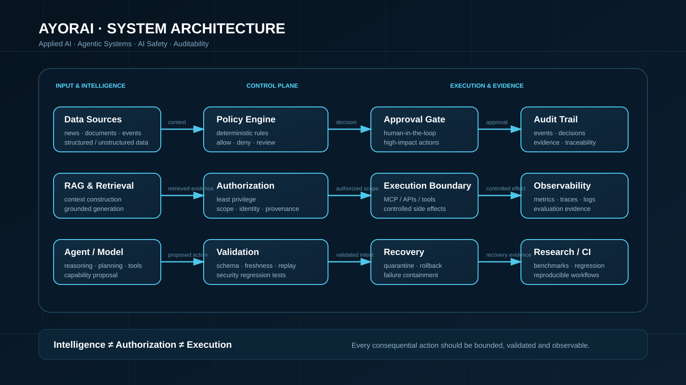

# AYORAI · Applied Intelligence

> **AI Engineering · Applied AI · Agentic Systems · AI Safety**

Public engineering hub by **Anderson Leon Ayora**, focused on building AI systems with explicit boundaries between intelligence, authorization, execution and auditability.

## System architecture

**Core principle:** Intelligence ≠ Authorization ≠ Execution

  

---

## What this repository demonstrates

This repository is the **public portfolio hub** for a broader AI Engineering portfolio.

It combines:

- technology intelligence and structured data pipelines;
- agentic AI and orchestration;
- RAG and Document Intelligence;
- MCP/tool integration;
- runtime AI security and policy enforcement;
- controlled evaluation and audit evidence;
- automation with reproducible engineering practices.

The site is deliberately curated to expose engineering work rather than act as a generic personal homepage.

---

## Featured engineering track

| Layer | Project | Engineering focus |
|---|---|---|
| **01 · AI Safety** | [AYORAI AI Shield](https://github.com/Ayorinha/ayorai-vision-intelligence) | deterministic runtime security, policy enforcement, action validation |
| **02 · Applied AI** | [AYORAI](https://github.com/Ayorinha/ayorai) | agentic systems, RAG, integrations and automation |
| **03 · Agent Security** | [AgentHound](https://github.com/Ayorinha/AgentHound) | agent capability analysis, defensive evaluation and boundaries |
| **04 · MCP Security** | [MCP-Sentinel](https://github.com/Ayorinha/MCP-Sentinel) | least privilege, schema validation, approvals and audit |
| **05 · Orchestration** | [AyorGraph](https://github.com/Ayorinha/AyorGraph) | graph-based agent workflows and observable execution |
| **06 · Retrieval** | [RAG Framework](https://github.com/Ayorinha/RAG-framework) | retrieval, context construction and grounded generation |
| **07 · Tooling** | [vault-mcp](https://github.com/Ayorinha/vault-mcp) | controlled tool access and MCP integration |
| **08 · Data Engineering** | [Hybrid Data Management RPA Pipeline](https://github.com/Ayorinha/hybrid-data-management-rpa-pipeline) | pipelines, automation and operational traceability |

---

## Portfolio architecture

~~~text
                    AYORAI · APPLIED INTELLIGENCE
                               │
             ┌─────────────────┴─────────────────┐
             │                                   │
        INTELLIGENCE                         CONTROL
             │                                   │
     ┌───────┼────────┐                  ┌───────┼────────┐
     │       │        │                  │       │        │
    RAG   Agents   Document AI         Policy  Security  Audit
     │       │        │                  │       │        │
     └───────┴────────┴──────────┬───────┴───────┴────────┘
                                  │
                              EXECUTION
                                  │
                       Human approval / tools
                                  │
                              Evidence
~~~

The portfolio is intentionally organized around **system boundaries**, not only model capabilities.

---

## Public platform

The GitHub Pages application provides four public surfaces:

- **Technology News** — curated and structured technology intelligence.
- **AI Index** — directory of AI tools and technologies.
- **AI Laboratory** — controlled defensive evaluation surface.
- **Shield Research** — technical research, threat model and validation material.

The public laboratory uses synthetic/controlled scenarios and is not presented as a certification or as a production endpoint-security product.

---

## Security and AI Safety

The security work follows a defensive engineering model:

- deterministic policy checks;
- explicit authorization boundaries;
- least-privilege principles;
- schema and input validation;
- human approval for high-impact actions;
- audit/event evidence;
- regression tests;
- controlled benchmark scenarios;
- separation between implemented capabilities and future concepts.

### Security boundary

~~~text
LLM / Agent
    │
    ▼
Intent / Proposed Action
    │
    ▼
Policy + Validation
    │
    ├── DENY ───────────────► Audit
    │
    ├── REVIEW ─────────────► Human approval
    │
    └── ALLOW ──────────────► Controlled execution
                                      │
                                      ▼
                                   Evidence
~~~

---

## Repository structure

~~~text
.
├── .github/workflows/       # CI, scheduled data and security automation
├── audit/                   # benchmark and evidence records
├── data/                    # published news and portfolio metadata
├── docs/                    # technical and security documentation
├── labs/                    # executable defensive-agent research
├── scripts/                 # ingestion and benchmark automation
├── tests/                   # regression/security tests
├── assets/                  # portfolio visual assets
│   └── system-architecture.svg
├── index.html               # main intelligence/news surface
├── ai-tools.html            # AI Index
├── ai-radar.html            # public Security Lab UI
├── shield-research.html     # Shield research
├── security-report.html     # historical security report
├── script.js                # main application controller
├── package.json
├── requirements.txt
└── README.md
~~~

### Legacy URL compatibility

The public laboratory is now presented as **AYORAI AI Laboratory / Security Lab**. The ai-radar.* filenames remain for URL compatibility with existing GitHub Pages references.

---

## Engineering standards

| Standard | Evidence in portfolio |
|---|---|
| Reproducibility | tests, scripts, deterministic workflows |
| Security boundaries | Shield, MCP-Sentinel, AgentHound |
| Observability | execution traces, evidence and audit records |
| Data engineering | structured datasets and ingestion pipelines |
| AI engineering | RAG, agents, orchestration and tool integration |
| Automation | GitHub Actions and scheduled pipelines |
| Documentation | architecture, threat models and research pages |
| Privacy | synthetic/public data for security demonstrations |
| Operational discipline | explicit separation of implementation vs. roadmap |

---

## Why the portfolio is structured this way

The projects are presented as an engineering system:

~~~text
Data
  ↓
Retrieval / Intelligence
  ↓
Agentic reasoning
  ↓
Policy / Authorization
  ↓
Tool execution
  ↓
Audit / Observability
~~~

This makes the portfolio readable from both an **AI Engineering** and **AI Safety / Security Engineering** perspective.

---

## Automation

GitHub Actions supports scheduled data ingestion and security/reference evaluation. Generated public datasets are committed only where the corresponding workflow requires it.

The repository does not require private organizational credentials or internal business datasets to reproduce the public portfolio experience.

---

## Privacy and attribution

The news pipeline stores metadata and links to original sources. It does not claim ownership of third-party articles.

Security demonstrations use controlled or synthetic scenarios and avoid offensive automation against external systems.

---

## Portfolio positioning

**AI Engineering · Applied AI · Agentic Systems · AI Safety · LLM Security · RAG · MCP · Document Intelligence · RPA · Data Engineering · Python · GitHub Actions**

## Author

**Anderson Leon Ayora**  
AI Engineer · Data Scientist

**AYORAI · Applied Intelligence**

---

### Start here

- **Flagship security:** [AYORAI AI Shield](https://github.com/Ayorinha/ayorai-vision-intelligence)
- **Agentic AI:** [AYORAI](https://github.com/Ayorinha/ayorai)
- **Agent security:** [AgentHound](https://github.com/Ayorinha/AgentHound)
- **MCP security:** [MCP-Sentinel](https://github.com/Ayorinha/MCP-Sentinel)
- **Public platform:** [Global Tech News AI](https://github.com/Ayorinha/global-tech-news-ai)
- **Professional profile:** [LinkedIn](https://www.linkedin.com/in/anderson-leon-ayora)
