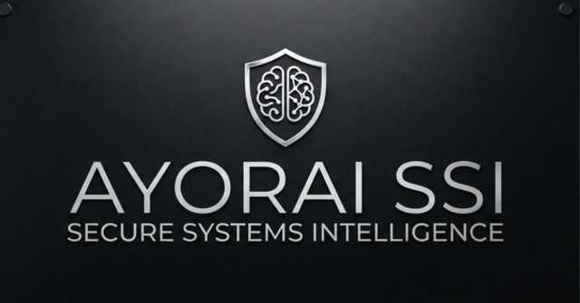

# AYORAI SSI



> **Secure Systems Intelligence · AI Security for Intelligent Systems**

> **Secure Systems Intelligence**
>
> *AI Security for Intelligent Systems.*

**AYORAI SSI** is the umbrella security architecture that connects AYORAI's research, defensive controls, adversarial evaluation and controlled agent operations.

It is the consolidated identity for the architecture previously called **Great Attractor**, while preserving the same architecture and safety boundaries.

## Architecture

```
                         AYORAI SSI
                 Secure Systems Intelligence
                                  │
             ┌────────────────────┼────────────────────┐
             │                    │                    │
         AI Shield          AI Laboratory       Agent Defense
          Defense              Research             Evaluation
             │                    │                    │
             └────────────────────┼────────────────────┘
                                  │
                           AI Defense Core
                                  │
                 ┌────────────────┼────────────────┐
                 │                │                │
                RAG              MCP            Policy
                 │                │                │
                 └────────────────┼────────────────┘
                                  │
                           Safety Gate
                                  │
                        Human-in-the-loop
                                  │
                          Proposed Action
                                  │
                              Audit Log
```

## What it does

The current implementation is a deterministic, local secure-agent foundation. It demonstrates how an operational agent can consume knowledge while remaining behind explicit policy and human-approval boundaries.

- Local RAG / knowledge retrieval
- Agent task orchestration
- Least-privilege policy evaluation
- Sensitive-request blocking
- Human approval for external actions
- Proposed actions instead of uncontrolled execution
- Structured audit evidence
- Deterministic tests and CI validation

## How the AYORAI security stack fits

| Layer | AYORAI capability | Role |
|---|---|---|
| Research | **AI Laboratory** | Threat research, benchmarks and controlled evaluation |
| Defense | **AI Shield** | Defensive boundaries and security controls |
| Evaluation | **Agent Defense Lab** | Adversarial testing of defensive agents |
| Architecture | **AYORAI SSI** | Secure Systems Intelligence umbrella and coordination layer |
| Operations | **Secure Operations Agent** | First practical agent implementation |
| Protection | **AI Antivirus** | Planned/expanding protection layer for AI systems |

The existing projects remain independently testable. **AYORAI SSI** provides the architectural relationship between them.

## Safety boundary

This public lab is intentionally safe and local. It does not send email, access credentials, execute arbitrary shell commands, modify production systems or target external systems.

High-impact external actions require human approval in the architecture and are not executed by this public implementation.

## Current workflow

```
User Request
    ↓
Agent
    ↓
Local RAG
    ↓
Policy Engine
    ↓
Safety Gate
    ↓
Human Approval
    ↓
Proposed Action
    ↓
Audit
```

## Roadmap

1. Model adapter behind the existing policy boundary
2. MCP tool registry with explicit allowlists
3. Multi-agent routing with isolated permissions
4. Provenance and evidence ledger
5. Continuous AI Safety evaluation
6. Human approval workflows for high-impact operations
7. AI Antivirus / runtime defense layer

The roadmap does not grant the model direct authority. Policy remains the authorization boundary.

## Run

```bash
pip install -r requirements.txt
python -m app.cli "prepare an NSA validation checklist"
pytest -q
```

## Relationship to the AI Safety stack

**AYORAI SSI is the umbrella security architecture.** AI Shield remains the defensive layer; AI Laboratory remains the research/evaluation surface; Agent Defense Lab remains the executable adversarial evaluation environment.

**Research → Defense → Evaluation → Secure Systems Intelligence → Controlled Action → Audit**
